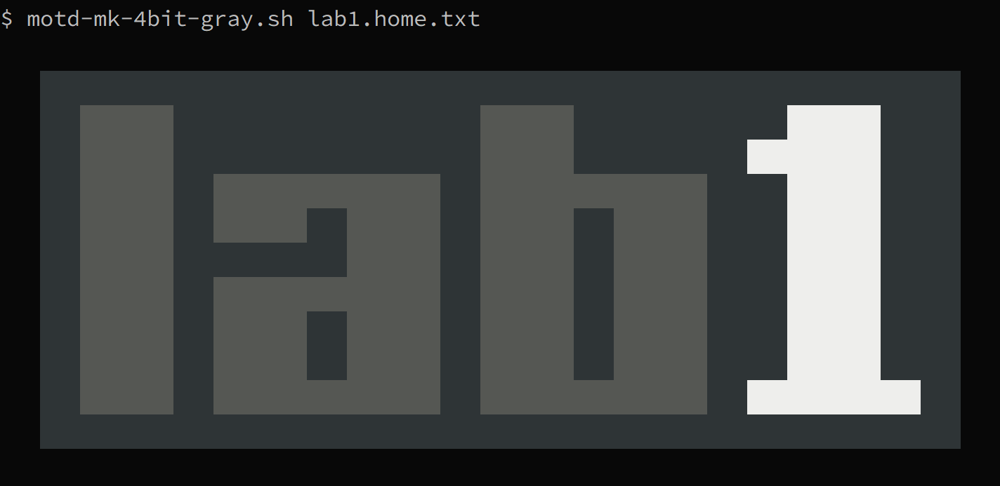

# Make 4-bit gray MOTDs

Convert a text file (or stdin) to terminal color codes using the characters in
table below.  It's primarily intended for making MOTDs for command-line usage,
e.g. `bash`, `ssh`, `gnome-terminal`, etc.  

| Color            | Character       |
| ---------------- | --------------- |
| transparent      | ` ` space       |
| dark gray        | `_` underscore  |
| dark white       | `#` number sign |
| bold/light gray  | `^` caret       |
| bold/light white | `@` at sign     |

These characters where chosen to minimize the overlap with "normal" characters you might find in a MOTD, e.g. host/domain names, but obviously this is imperfect.  If you run into an issues, manually modify the output, or append/prepend your text afterwards.

As a fallback (and so copy/paste still works), the original text is preserved,
but the foreground and background colors are set to the same value to give them
a blocky appearance.


## Usage

```shell
motd-mk-4bit-gray.sh "$FILE"

# -- or --
echo "$TEXT" | motd-mk-4bit-gray.sh
```

Example file:

```text
$ cat -n lab1.home.txt
     1
     2     _____________________________________________________________________
     3     ___^^^^^^^_______________________^^^^^^^________________@@@@@@@______
     4     ___^^^^^^^_______________________^^^^^^^_____________@@@@@@@@@@______
     5     ___^^^^^^^___^^^^^^^^^^^^^^^^^___^^^^^^^^^^^^^^^^^______@@@@@@@______
     6     ___^^^^^^^___^^^^^^^___^^^^^^^___^^^^^^^___^^^^^^^______@@@@@@@______
     7     ___^^^^^^^_____________^^^^^^^___^^^^^^^___^^^^^^^______@@@@@@@______
     8     ___^^^^^^^___^^^^^^^^^^^^^^^^^___^^^^^^^___^^^^^^^______@@@@@@@______
     9     ___^^^^^^^___^^^^^^^___^^^^^^^___^^^^^^^___^^^^^^^______@@@@@@@______
    10     ___^^^^^^^___^^^^^^^___^^^^^^^___^^^^^^^___^^^^^^^______@@@@@@@______
    11     ___^^^^^^^___^^^^^^^^^^^^^^^^^___^^^^^^^^^^^^^^^^^___@@@@@@@@@@@@@___
    12     _____________________________________________________________________
    13
```

Example output:


